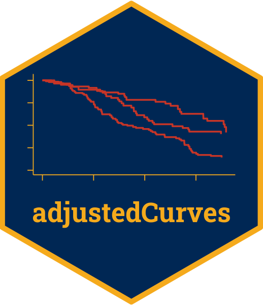
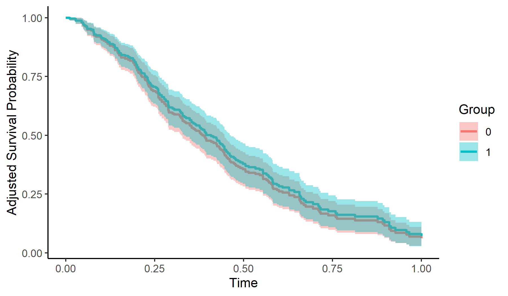
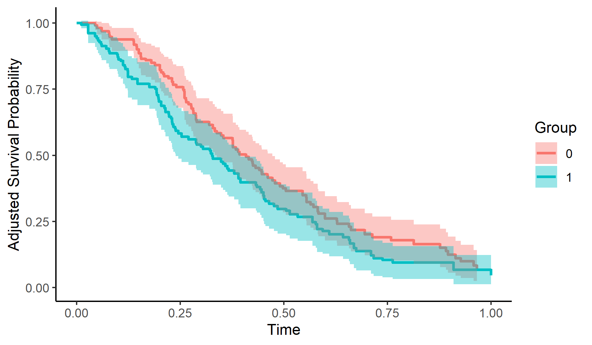

<!-- badges: start -->
[](https://www.repostatus.org/#wip)
[](https://cran.r-project.org/package=adjustedCurves)
[](https://cran.r-project.org/package=adjustedCurves)
[](https://github.com/RobinDenz1/adjustedCurves/actions)
<!-- badges: end -->

# adjustedCurves 

Author: Robin Denz

## Description

`adjustedCurves` is an R-Package which can be used to calculate and plot confounder-adjusted survival curves + confidence intervals as well as cause-specific confounder-adjusted cumulative incidence functions + confidence intervals using a variety of methods.
It provides an convenient wrapper around existing R-Packages on the topic and adds additional methods and functionality on top of it.
Those additional features include the calculation of adjusted restricted mean survival times and testing whether two confounder-adjusted survival curves are different in a given interval.

Detailed descriptions of each method can be found in the literature cited in the documentation. 

## Installation

Currently this package is not available on CRAN, but can be installed easily using the `devtools` R-Package:

```R
library(devtools)

devtools::install_github("https://github.com/RobinDenz1/adjustedCurves")
```

or the `remotes` R-Package:

```R
library(remotes)

remotes::install_github("https://github.com/RobinDenz1/adjustedCurves")
```

## Bug Reports and Feature Requests

If you encounter any bugs or have any specific feature requests, please file an [Issue](https://github.com/RobinDenz1/adjustedCurves/issues).

## Examples

This minimal example shows how to calculate and plot adjusted survival curves using *Direct Adjustment* with this package:

```R
library(adjustedCurves)
library(survival)

# simulate some data as example
set.seed(31)
sim_dat <- sim_confounded_surv(n=250, max_t=1.2, group_beta=0)
sim_dat$group <- as.factor(sim_dat$group)

# estimate a cox-regression for the outcome
cox_mod <- coxph(Surv(time, event) ~ x1 + x2 + x4 + x5 + group,
                 data=sim_dat, x=TRUE)

# use it to calculate adjusted survival curves
adjsurv <- adjustedsurv(data=sim_dat,
                        variable="group",
                        ev_time="time",
                        event="event",
                        method="direct",
                        outcome_model=cox_mod,
                        conf_int=TRUE)

# plot with confidence intervals
plot(adjsurv, draw_ci=TRUE)
```


Here is an example of how to calculate and plot adjusted survival curves using *Inverse Probability of Treatment Weighting*:
```R
# estimate a treatment assignment model
glm_mod <- glm(group ~ x2 + x3 + x5 + x6, data=sim_dat,
               family="binomial"(link="logit"))


# use it to calculate adjusted survival curves
adjsurv <- adjustedsurv(data=sim_dat,
                        variable="group",
                        ev_time="time",
                        event="event",
                        method="iptw_km",
                        treatment_model=glm_mod,
                        conf_int=TRUE)

# plot with confidence intervals
plot(adjsurv, draw_ci=TRUE)
```


To test whether the two adjusted survival curves are different in a specified interval (here 0 to 0.75), the `adjustedsurv` call has to be made with `bootstrap=TRUE`:
```R
adjsurv <- adjustedsurv(data=sim_dat,
                        variable="group",
                        ev_time="time",
                        event="event",
                        method="direct",
                        outcome_model=cox_mod,
                        conf_int=TRUE,
                        bootstrap=TRUE,
                        n_boot=1000)

adj_test <- adjusted_curve_diff(adjsurv, from=0, to=0.75)
summary(adj_test)
```

More examples can be found in the documentation and the vignettes.

## Citation
Please cite this R-Package using:
MY PAPER

You should also cite the paper describing the method you used. The respective literature can be found in the documentation.

## License

© 2021-2022 Robin Denz

The contents of this repository are distributed under the GNU General Public License. You can find the full text of this License in this github repository. Alternatively, see <http://www.gnu.org/licenses/>.


