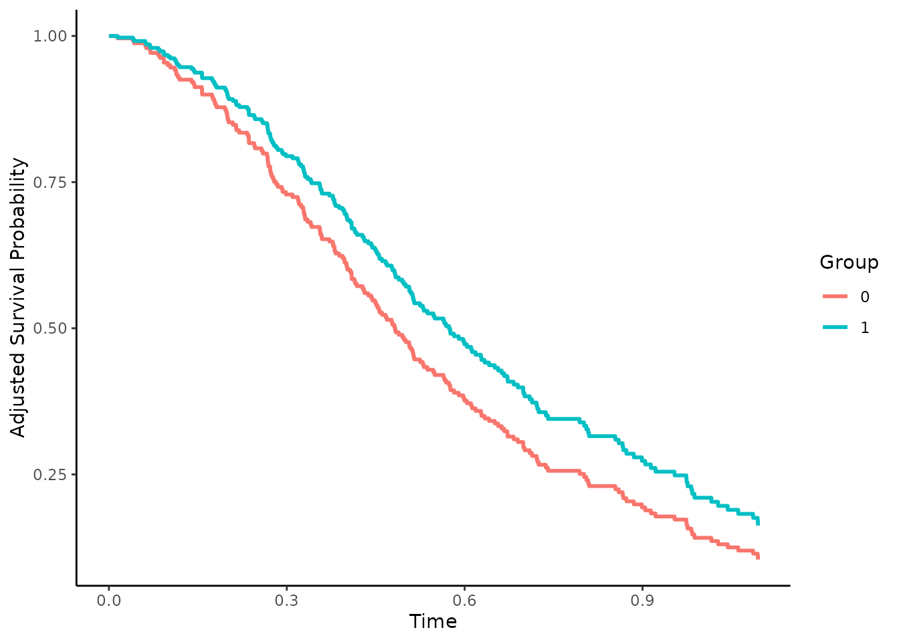
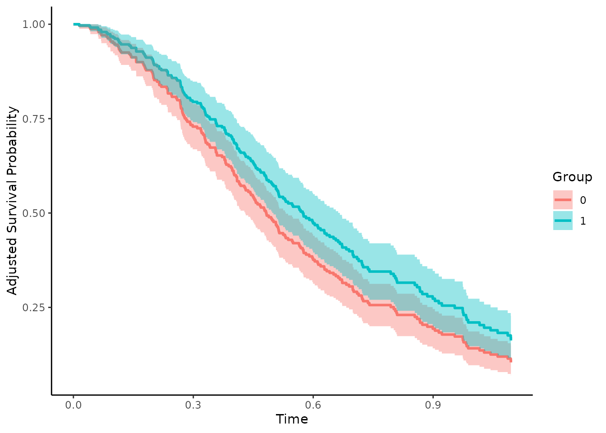
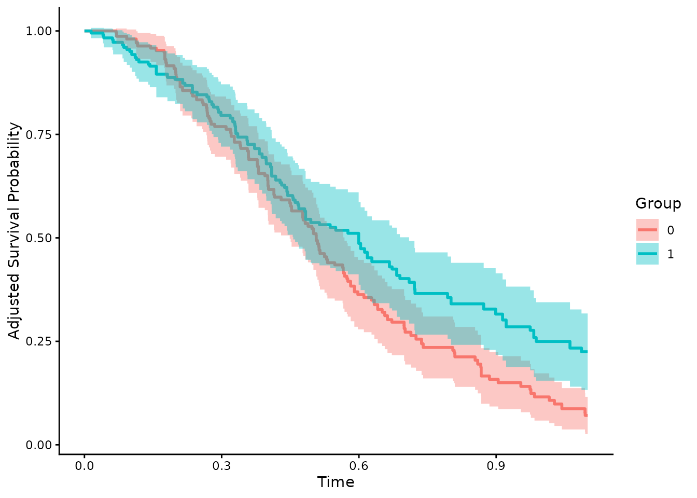
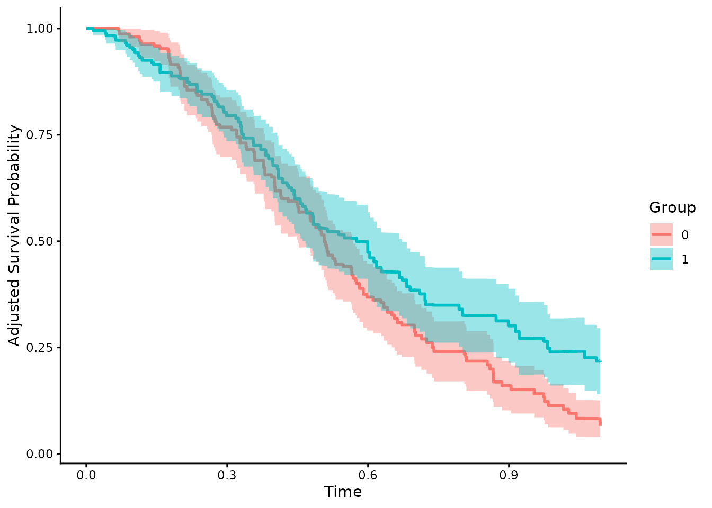
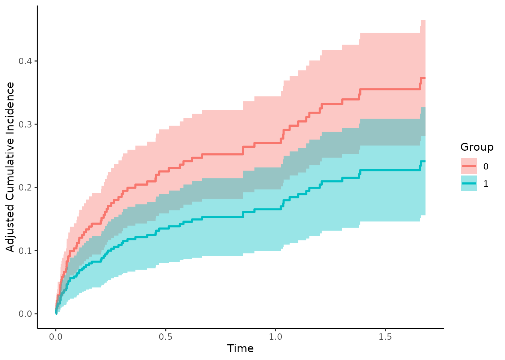
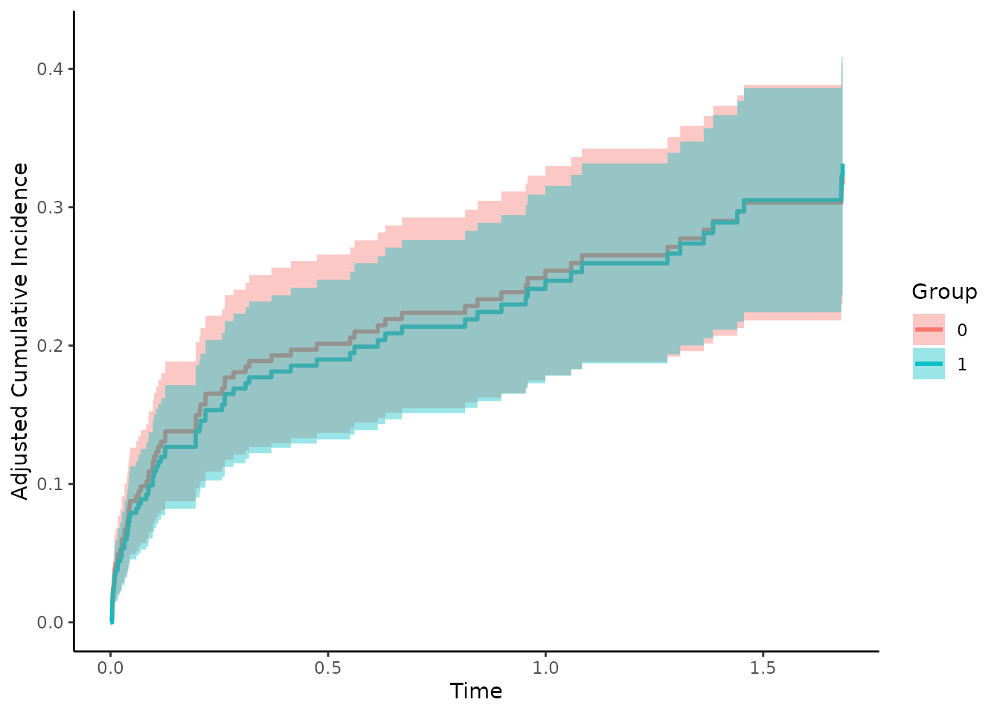
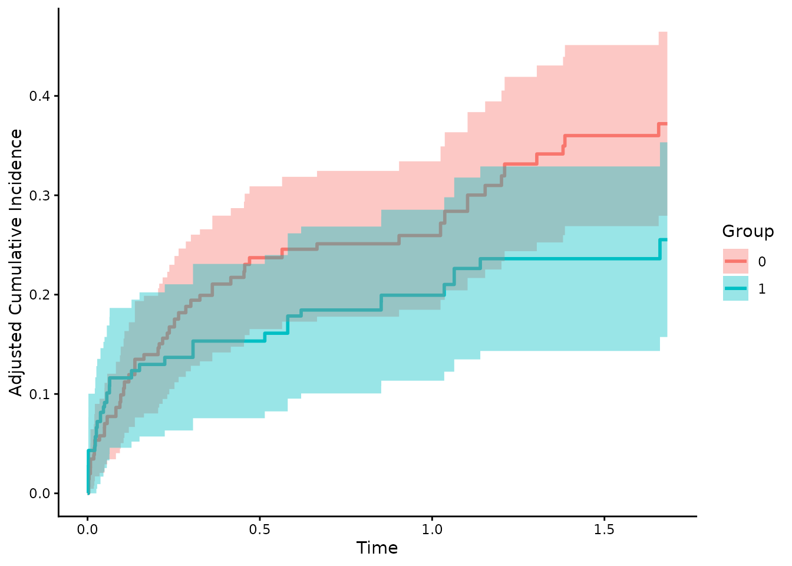
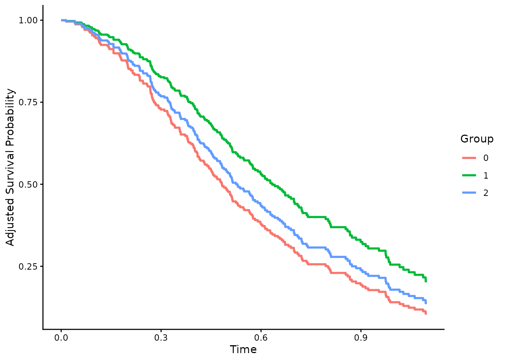
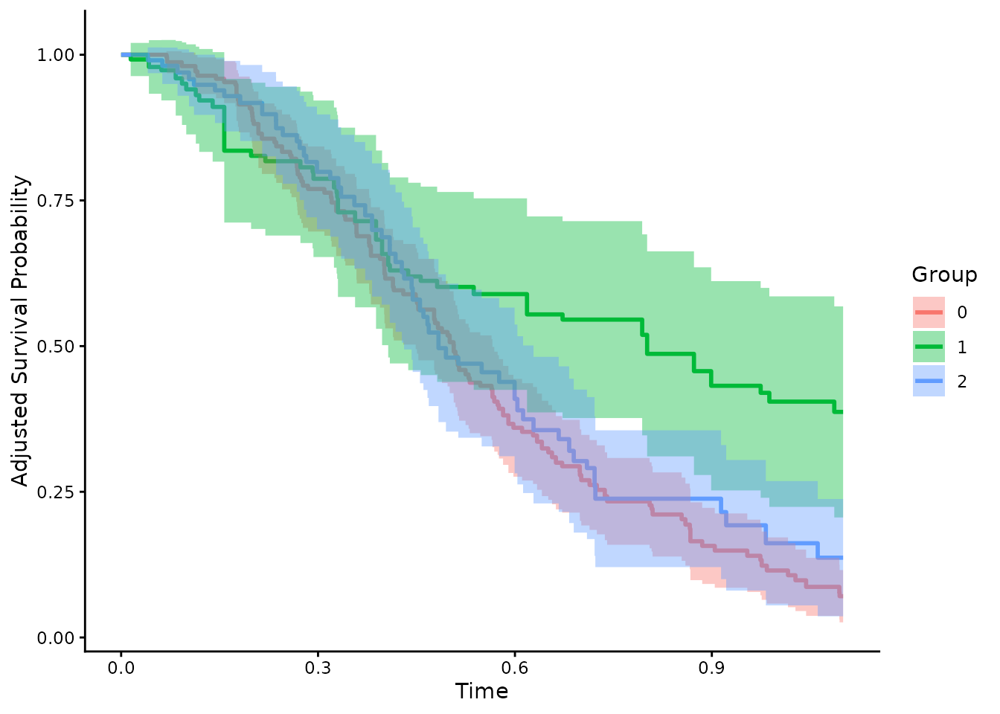

# An Introduction to the 'adjustedCurves' Package

The main purpose of the `adjustedCurves` R-Package is to estimate and
plot confounder-adjusted survival curves and cause-specific
confounder-adjusted cumulative incidence functions (CIF) using a variety
of methods. Group- or treatment-specific survival curves and CIFs are
often used to graphically display the treatment (or group) effect on the
survival probability. When the data at hand comes from a randomized
controlled trial with balanced subgroups, simple stratified estimators
of the survival curves or CIFs ignoring other covariates are unbiased.
When randomization fails or was not done at all however, confounding can
lead to biased depictions (see Pearl 2009).

Luckily, a lot of different methods to adjust survival curves and CIFs
for confounding have been proposed. With the `adjustedCurves` package,
these methods can be used with little effort. A review and simulation
study comparing these methods can be found in Denz et al. (2023).

## Installation

A stable version of this package can be installed directly from CRAN:

``` r
install.packages("adjustedCurves")
```

Alternatively, the developmental version can be installed from github
using the `remotes` package:

``` r
remotes::install_github("RobinDenz1/adjustedCurves")
```

Further packages might have to be installed, depending on the specified
method.

## Adjusted Survival Curves

Let’s start with the standard survival setting. Using the
`sim_confounded_surv` function, we simulate some survival data:

``` r
library(survival)
library(ggplot2)
library(riskRegression)
library(pammtools)
library(adjustedCurves)

# set random number generator seed to make this reproducible
set.seed(44)

# simulate standard survival data with 300 rows
data_1 <- sim_confounded_surv(n=300, max_t=1.1, group_beta=-0.6)
# code the grouping variable as a factor
data_1$group <- as.factor(data_1$group)

# take a look at the first few rows
head(data_1)
```

    ##   x1 x2 x3          x4          x5          x6 group       time event
    ## 1  1  0  0 -0.52520986  0.22776621 -0.05319665     1 0.37181297     1
    ## 2  0  1  1  0.02441988 -2.16818274  0.58097459     0 0.65649863     1
    ## 3  1  1  1  0.05159071  0.07329185  1.18737651     1 0.08156474     0
    ## 4  1  0  0  0.01956631 -1.27205270  1.16594437     0 0.34161603     1
    ## 5  0  1  0  0.33793112  1.32447922 -1.28991227     0 0.52472847     1
    ## 6  0  1  0 -2.96505672  2.19434272  0.00528396     1 0.87274894     1

Using the default arguments, this function outputs a data.frame with 6
independently drawn covariates (`x1` - `x6`), a binary group variable
(`group`), the observed event time (`time`) and the event indicator
(`event`). In this setting, there is only one type of event (`1`). When
the observations are right-censored this indicator is set to `0`. This
is the standard data format used in standard time-to-event analysis.

### Direct Standardization

To calculate confounder-adjusted survival curves fo each group of this
dataset using *Direct Standardization* (also known as *G-Computation* or
*Corrected Group Prognosis method*, see Makuch (1982) or Chang et
al. (1982)), we first have to fit a model. Here we will use a `coxph`
model, but we could also use pretty much any other kind of model.

``` r
# it is important to use X=TRUE in the coxph function call
outcome_model <- survival::coxph(Surv(time, event) ~ x1 + x2 + x3 + x4 + x5 + 
                                   x6 + group, data=data_1, x=TRUE)
```

This model can then be used in a call to the
[`adjustedsurv()`](https://robindenz1.github.io/adjustedCurves/reference/adjustedsurv.md)
function, as shown below:

``` r
adjsurv <- adjustedsurv(data=data_1,
                        variable="group",
                        ev_time="time",
                        event="event",
                        method="direct",
                        outcome_model=outcome_model,
                        conf_int=TRUE)
```

The argument `data` simply refers to our data.frame, the argument
`variable` specifies our grouping variable of interest and the `ev_time`
and `event` variable specify the time-to-event variables in our
data.frame. Setting the `method` to `"direct"` will result in
G-Computation estimates, based on the previously fit cox-regression
model supplied using the `outcome_model` argument.

Doing this returns a list with some needed output objects. Most
important however is the `adj` data.frame in there, containing the
adjusted survival curves and corresponding confidence intervals (because
we used `conf_int=TRUE` in the original function call). We can take a
look at this object using the following code:

``` r
head(adjsurv$adj)
```

    ##         time      surv group          se  ci_lower  ci_upper
    ## 1 0.00000000 1.0000000     0 0.000000000 1.0000000 1.0000000
    ## 2 0.01457659 0.9959356     0 0.004039858 0.9880177 1.0000000
    ## 3 0.04062032 0.9917639     0 0.005767859 0.9804591 1.0000000
    ## 4 0.04232678 0.9876128     0 0.007034862 0.9738247 1.0000000
    ## 5 0.06129069 0.9834495     0 0.008123567 0.9675276 0.9993714
    ## 6 0.06271999 0.9792709     0 0.009066121 0.9615017 0.9970402

More importantly however, we can plot the survival curves directly using
the `plot` method:

``` r
plot(adjsurv)
```

    ## Ignoring unknown labels:
    ## • linetype : "Group"
    ## • fill : "Group"



This plot function comes with many options which are listed in the
documentation. To plot the point-wise confidence intervals, we can set
the argument `conf_int` to TRUE:

``` r
plot(adjsurv, conf_int=TRUE)
```

    ## Ignoring unknown labels:
    ## • linetype : "Group"



Many more custom settings, such as median survival time indicator lines,
censoring indicator lines and risk tables are available. For more
details and examples see
[`?plot.adjustedsurv`](https://robindenz1.github.io/adjustedCurves/reference/plot.adjustedsurv.md)
or the associated vignette, which goes in even more detail on how the
plots can be customized.

### Inverse Probability of Treatment Weighting

The
[`adjustedsurv()`](https://robindenz1.github.io/adjustedCurves/reference/adjustedsurv.md)
function essentially works the same with every available method. Since
the methods are however vastly different in nature, some additional
arguments have to be supplied by the user. For example, using the
Inverse Probability of Treatment Weighting method (IPTW), we need to
model the *treatment assignment mechanism* instead of the outcome
mechanism (see Xie and Liu (2005)). This can be done in many ways. Below
we use a logistic regression model for exemplary purposes:

``` r
treatment_model <- glm(group ~ x1 + x2 + x3 + x4 + x5 + x6,
                       data=data_1, family="binomial"(link="logit"))

adjsurv <- adjustedsurv(data=data_1,
                        variable="group",
                        ev_time="time",
                        event="event",
                        method="iptw_km",
                        treatment_model=treatment_model,
                        conf_int=TRUE)
```

The resulting curves can be plotted as before:

``` r
plot(adjsurv, conf_int=TRUE)
```

    ## Ignoring unknown labels:
    ## • linetype : "Group"



Since both methods were used correctly here, there are only slight
differences in the results. Big differences between the two methods
usually indicate that either the outcome model or the
treatment-assignment model are incorrectly specified.

### Augmented Inverse Probability of Treatment Weighting

Doubly-Robust methods can be helpful in such cases (Ozenne et al. 2020).
The standard Augmented Inverse Probability of Treatment Weighting
estimator utilized both kinds of models at the same time. If either of
the models is correctly specified, the resulting estimates will be
unbiased. It can be used in the same way as the other methods, only that
this time both models have to be supplied. Using the same models as
above we can use the following syntax:

``` r
adjsurv <- adjustedsurv(data=data_1,
                        variable="group",
                        ev_time="time",
                        event="event",
                        method="aiptw",
                        treatment_model=treatment_model,
                        outcome_model=outcome_model,
                        conf_int=TRUE)

plot(adjsurv, conf_int=TRUE)
```

    ## Ignoring unknown labels:
    ## • linetype : "Group"



## Adjusted Cumulative Incidence Functions

In many situations there are multiple mutually exclusive types of events
instead of just one event. This is formally known as a competing risks
situation. In these situations, survival curves can not be estimated
anymore. However, the cumulative incidence function can be used instead.
Without randomization, these CIFs face the same problems due to
confounding as the survival curves do. Many of the methods to adjust
survival curves for confounders can be used to adjust CIFs in very
similar fashion.

While the computational details and the underlying theory is slightly
different (see Ozenne et al. 2020), the syntax for the R-Package stays
pretty much exactly the same. The only major difference is that instead
of using the
[`adjustedsurv()`](https://robindenz1.github.io/adjustedCurves/reference/adjustedsurv.md)
function, the
[`adjustedcif()`](https://robindenz1.github.io/adjustedCurves/reference/adjustedcif.md)
function should be utilized. Additionally, the user now also has to
specify which event-type is of interest using the `cause` argument.

First we need new example data, mirroring the competing risks situation.
We are going to use the
[`sim_confounded_crisk()`](https://robindenz1.github.io/adjustedCurves/reference/sim_confounded_crisk.md)
function, which does the same thing as the
[`sim_confounded_surv()`](https://robindenz1.github.io/adjustedCurves/reference/sim_confounded_surv.md)
function, but with competing risks data:

``` r
# simulate the data
data_2 <- sim_confounded_crisk(n=300)
data_2$group <- as.factor(data_2$group)

head(data_2)
```

    ##   x1 x2 x3          x4          x5          x6 group       time event
    ## 1  1  1  0  0.96216812 -0.66375234  0.65527293     1 0.02085406     0
    ## 2  1  1  0 -0.58477811  1.73696566 -0.18714061     1 0.18924205     0
    ## 3  1  0  0 -0.33549773  0.52008044  0.08290031     0 0.26288996     2
    ## 4  0  1  1 -0.04008865  0.19841348  0.38858944     1 0.08210559     2
    ## 5  0  0  1  0.78936972 -0.27545174  0.49322272     1 1.67993934     2
    ## 6  0  0  0  0.26001387 -0.03590098  0.86231143     1 1.70000000     0

### Direct Standardization

Let’s again start with the *Direct Standardization* method. Instead of
using a simple `coxph` method, we need to use a model for the
time-to-event process which takes the multiple event-types into account.
One such method is the *Cause-Specific Cox-Regression* model. A simple
implementation of this model is contained in the `riskRegression`
R-Package.

``` r
outcome_model <- riskRegression::CSC(Hist(time, event) ~ x1 + x2 + x3 + x4 + 
                                       x5 + x6 + group, data=data_2)
```

This model can then be used in a call to the
[`adjustedcif()`](https://robindenz1.github.io/adjustedCurves/reference/adjustedcif.md)
function, as shown below:

``` r
adjcif <- adjustedcif(data=data_2,
                      variable="group",
                      ev_time="time",
                      event="event",
                      method="direct",
                      outcome_model=outcome_model,
                      cause=1,
                      conf_int=TRUE)
plot(adjcif, conf_int=TRUE)
```



This shows the confounder-adjusted CIFs for `cause = 1`. By setting
`cause` to `2` we get the confounder-adjusted CIFs for the other cause:

``` r
adjcif <- adjustedcif(data=data_2,
                      variable="group",
                      ev_time="time",
                      event="event",
                      method="direct",
                      outcome_model=outcome_model,
                      cause=2,
                      conf_int=TRUE)
plot(adjcif, conf_int=TRUE)
```



### Inverse Probability of Treatment Weighting

The IPTW estimator can be used exactly the same way as we did with the
[`adjustedsurv()`](https://robindenz1.github.io/adjustedCurves/reference/adjustedsurv.md)
function:

``` r
treatment_model <- glm(group ~ x1 + x2 + x3 + x4 + x5 + x6,
                       data=data_2, family="binomial"(link="logit"))

adjcif <- adjustedcif(data=data_2,
                      variable="group",
                      ev_time="time",
                      event="event",
                      method="iptw",
                      treatment_model=treatment_model,
                      cause=1,
                      conf_int=TRUE)
plot(adjcif, conf_int=TRUE)
```

    ## Ignoring unknown labels:
    ## • linetype : "Group"



## Adjusted Curves with More than Two Groups

In many applications there are more than two treatments. Some of the
methods included in this R-Package allow calculations for an arbitrary
number of treatments. In these cases the code does not change at all and
can be used exactly in the same way as before. The only difference
occurs when using IPTW methods. Here the user has to use a multinomial
logistic regression model instead of a regular logistic regression to
model the outcome. This is illustrated below.

First we again create a simulated data set (for single event survival
data). The function is only able to create binary treatment variables,
but we can simply resample all occurrences of 1 into 1 and 2, creating 3
treatments, where 1 and 2 have an identical treatment effect and
selection process:

``` r
# add another group
# NOTE: this is done only to showcase the method and does not
#       reflect what should be done in real situations
data_1$group <- factor(data_1$group, levels=c("0", "1", "2"))
data_1$group[data_1$group=="1"] <- sample(c("1", "2"), replace=TRUE,
                                          size=nrow(data_1[data_1$group=="1",]))
```

The Direct Adjusted survival curves can be calculated exactly as before:

``` r
outcome_model <- survival::coxph(Surv(time, event) ~ x1 + x2 + x3 + x4 + 
                                   x5 + x6 + group, data=data_1, x=TRUE)

adjsurv <- adjustedsurv(data=data_1,
                        variable="group",
                        ev_time="time",
                        event="event",
                        method="direct",
                        outcome_model=outcome_model,
                        conf_int=TRUE)
plot(adjsurv)
```

    ## Ignoring unknown labels:
    ## • linetype : "Group"
    ## • fill : "Group"



For the IPTW based estimates we first fit a multinomial logistic
regression model using the `multinom` function from the `nnet` R-Package
and use it with the same code as before:

``` r
treatment_model <- nnet::multinom(group ~ x1 + x2 + x3 + x4 + x5 + x6,
                                  data=data_1)
```

    ## # weights:  24 (14 variable)
    ## initial  value 329.583687 
    ## iter  10 value 286.543657
    ## iter  20 value 283.765460
    ## final  value 283.765313 
    ## converged

``` r
adjsurv <- adjustedsurv(data=data_1,
                        variable="group",
                        ev_time="time",
                        event="event",
                        method="iptw_km",
                        treatment_model=treatment_model,
                        conf_int=TRUE)
plot(adjsurv, conf_int=TRUE)
```



## Further Topics

Only a few methods and the most important functionality of this package
were shown in this vignette. It includes a lot more methods and
functionality, which is described in great detail in both the
documentation and the other vignettes of this package.

### Implemented Methods

For users who want to learn more about the implemented methods, we
recommend consulting the documentation of the main functions first
([`?adjustedsurv`](https://robindenz1.github.io/adjustedCurves/reference/adjustedsurv.md)
or
[`?adjustedcif`](https://robindenz1.github.io/adjustedCurves/reference/adjustedcif.md)).
This page will also guide the user to more detailed method-specific
information. An overview of all implemented methods is given in the
associated vignette
([`vignette(topic="method_overview", package="adjustedCurves")`](https://robindenz1.github.io/adjustedCurves/articles/method_overview.md)).

### Plot Customization

The
[`plot.adjustedsurv()`](https://robindenz1.github.io/adjustedCurves/reference/plot.adjustedsurv.md)
function contains a lot of arguments to customize the adjusted survival
curve plots, which may be daunting at first. The associated vignette
([`vignette(topic="plot_customization", package="adjustedCurves")`](https://robindenz1.github.io/adjustedCurves/articles/plot_customization.md))
describes most of these options in great detail with multiple examples.

### Comparing Groups

Users may also be interested in formally comparing the (treatment)
groups after adjustment has been made. There are multiple ways to
perform such comparisons using this package for both standard
time-to-event data and data with competing events. A vignette explaining
what these different options are and how to use them is also included in
this package
([`vignette(topic="comparing_groups", package="adjustedCurves")`](https://robindenz1.github.io/adjustedCurves/articles/comparing_groups.md)).
We recommend consulting this vignette if group comparisons are of
interest.

### FAQ

Some of the most frequently asked questions are answered in the FAQ
vignette
([`vignette(topic="faq", package="adjustedCurves")`](https://robindenz1.github.io/adjustedCurves/articles/faq.md)).

## Literature

Robin Denz, Renate Klaaßen-Mielke, and Nina Timmesfeld (2023). “A
Comparison of Different Methods to Adjust Survival Curves for
Confounders”. In: Statistics in Medicine 42.10, pp. 1461-1479.

Judea Pearl (2009). Causality: Models, Reasoning and Inference. 2nd
ed. Cambridge: Cambridge University Press

Robert W. Makuch (1982). “Adjusted Survival Curve Estimation Using
Covariates”. In: Journal of Chronic Diseases 35.6, pp. 437-443.

I-Ming Chang, Rebecca Gelman, and Marcello Pagano (1982). “Corrected
Group Prognostic Curves and Summary Statistics”. In: Journal of Chronic
Diseases 35, pp. 669-674.

Jun Xie and Chaofeng Liu (2005). “Adjusted Kaplan-Meier Estimator and
Log-Rank Test with Inverse Probability of Treatment Weighting for
Survival Data”. In: Statistics in Medicine 24, pp. 3089-3110.

Brice Maxime Hugues Ozenne, Thomas Harder Scheike, and Laila Staerk
(2020). “On the Estimation of Average Treatment Effects with
Right-Censored Time to Event Outcome and Competing Risks”. In:
Biometrical Journal 62, pp. 751-763.
