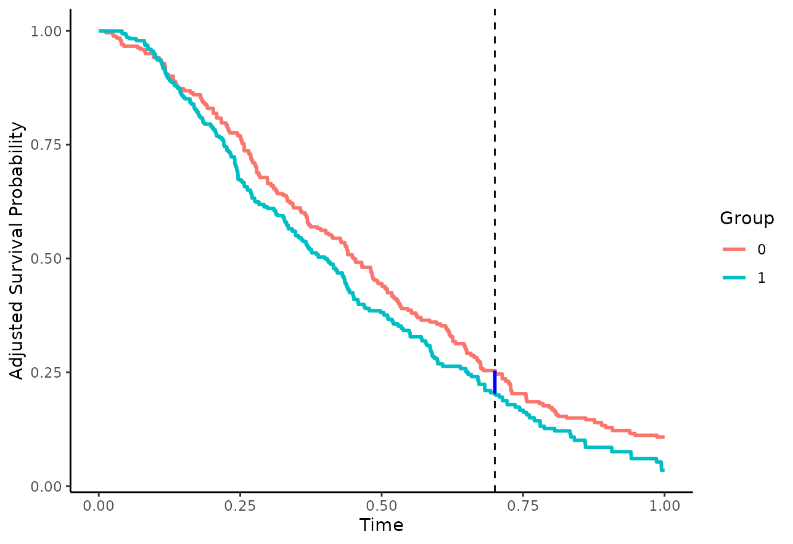
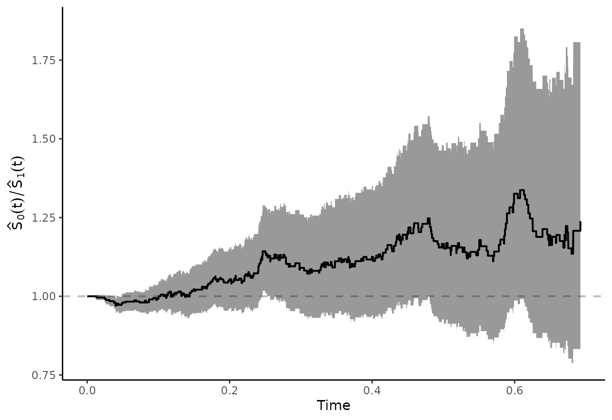
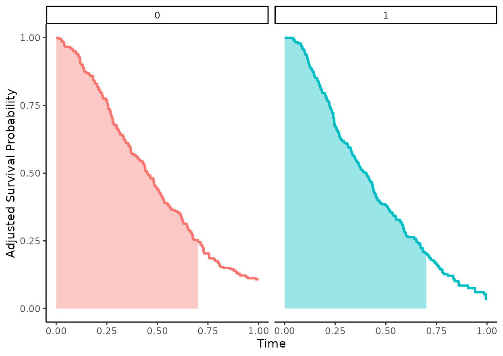
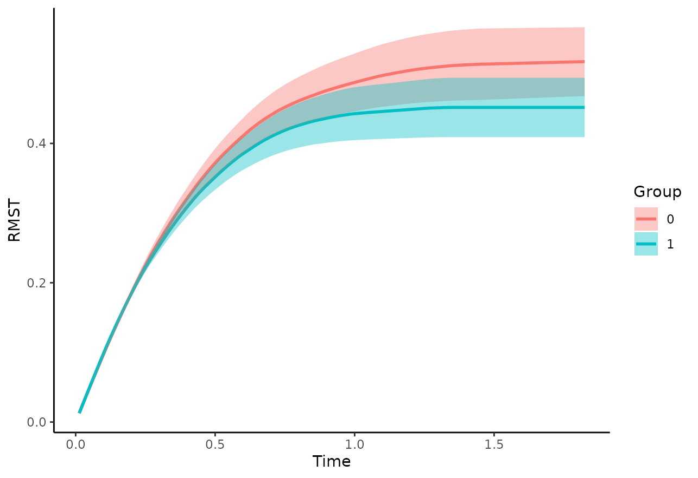
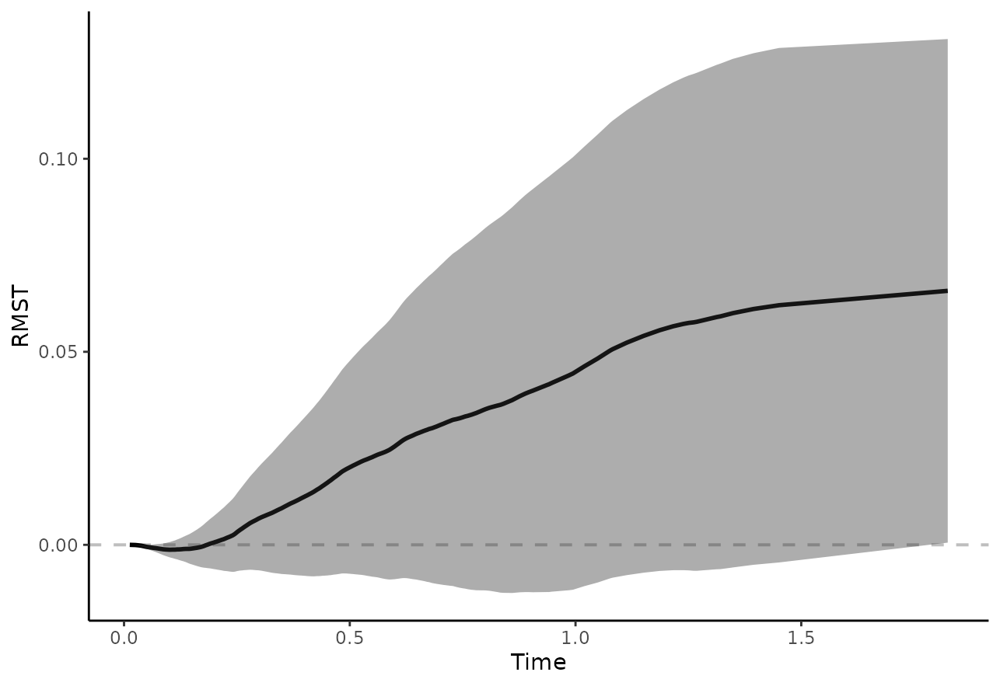
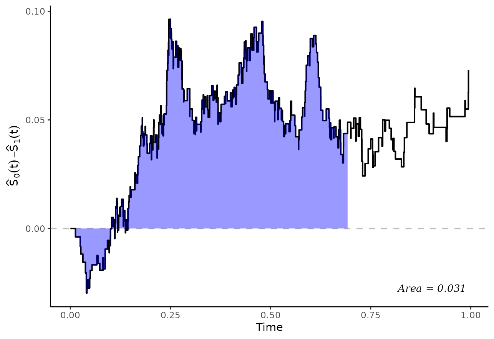

# Comparing Adjusted Survival Curves or Cumulative Incidence Curves

## Introduction

The main functions of this package can be used to estimate
confounder-adjusted survival curves and confounder-adjusted
cause-specific cumulative incidence curves. This is described in great
detail in the documentation and in other vignettes of this package. In
this vignette we present some possibilities of directly comparing the
adjusted survival curves or CIFs instead.

It is important to state right away that there is no single best method
to compare the curves. Each one is associated with a different target
estimand, which should be chosen mostly based on theoretical
considerations.

## Adjusted Survival Curves

Throughout this vignette we will mostly be concerned with comparing two
confounder-adjusted survival curves estimated using the
[`adjustedsurv()`](https://robindenz1.github.io/adjustedCurves/reference/adjustedsurv.md)
function. Situations with more than two survival curves are not covered
directly here, but users may use the presented methods to perform
pairwise comparisons among the possible pairings. Comparisons of
confounder-adjusted cause-specific CIFs can be performed in a very
similar fashion, as described later in this vignette.

### Illustrative Example Data

To illustrate the different ways of comparing two survival curves, we
again simulate some data using the
[`sim_confounded_surv()`](https://robindenz1.github.io/adjustedCurves/reference/sim_confounded_surv.md)
function. This time, we set the `group_beta` argument to 0, indicating
that there is no actual treatment effect here.

``` r
library(adjustedCurves)
library(survival)
library(ggplot2)
library(pammtools)
library(cowplot)

set.seed(34253)

data <- sim_confounded_surv(n=500, group_beta=0)
data$group <- factor(data$group)
```

We then use the
[`adjustedsurv()`](https://robindenz1.github.io/adjustedCurves/reference/adjustedsurv.md)
function to estimate the confounder-adjusted survival curves using
inverse probability of treatment weighting (`method="iptw_km"`, see Xie
et al. 2005). Note that we compute asymptotic confidence intervals
(`conf_int=TRUE`) and we also perform bootstrapping with 100
replications. The bootstrapping is done here, because some of the
comparison methods require it. In reality, 100 bootstrap samples would
probably not be enough to get stable estimates. We limit this number to
100 here only due to computation time limitations of CRAN.

``` r
adjsurv <- adjustedsurv(data=data,
                        variable="group",
                        ev_time="time",
                        event="event",
                        method="iptw_km",
                        treatment_model=group ~ x2 + x5,
                        conf_int=TRUE,
                        bootstrap=TRUE,
                        n_boot=100,
                        stabilize=TRUE)
```

    ## Loading required namespace: WeightIt

The resulting survival curves look like this:

``` r
plot(adjsurv, conf_int=TRUE, risk_table=TRUE, risk_table_stratify=TRUE,
     risk_table_digits=0, x_n_breaks=10)
```

    ## Ignoring unknown labels:
    ## • linetype : "Group"
    ## Ignoring unknown labels:
    ## • linetype : "Group"
    ## Ignoring unknown labels:
    ## • linetype : "Group"

    ## Warning: Removed 7 rows containing missing values or values outside the scale range
    ## (`geom_stepribbon()`).


Visually, there does not seem to be a large difference between the
curves, which is what we would expect because there is no actual
treatment effect and we correctly adjusted for the two confounders `x2`
and `x5`.

### Contrasting Survival Probabilities at $t$

The probably easiest way to compare two survival curves is to directly
compute their difference (Klein et al. 2007):

$${\widehat{S}}_{diff}(t) = {\widehat{S}}_{0}(t) - {\widehat{S}}_{1}(t)$$

or the ratio between them:

$${\widehat{S}}_{ratio}(t) = \frac{{\widehat{S}}_{1}(t)}{{\widehat{S}}_{0}(t)}$$

at a specific point in time $t$. Here, ${\widehat{S}}_{z}(t)$ is the
estimated adjusted survival probability at $t$, as returned by the
[`adjustedsurv()`](https://robindenz1.github.io/adjustedCurves/reference/adjustedsurv.md)
function. Visually this is equivalent to the *vertical difference*
between the curves, as shown here with a blue line segment at $t = 0.7$:

    ## Ignoring unknown labels:
    ## • linetype : "Group"
    ## • fill : "Group"



These quantities can be estimated directly using the
[`adjusted_curve_diff()`](https://robindenz1.github.io/adjustedCurves/reference/adjusted_curve_diff.md)
and
[`adjusted_curve_ratio()`](https://robindenz1.github.io/adjustedCurves/reference/adjusted_curve_diff.md)
functions. For $t = 0.7$ (arbitrary choice) we could use:

``` r
adjusted_curve_diff(adjsurv, times=0.7, conf_int=TRUE)
```

    ##   time       diff         se    ci_lower  ci_upper   p_value
    ## 1  0.7 0.04890463 0.04366823 -0.03668352 0.1344928 0.2627507

or

``` r
adjusted_curve_ratio(adjsurv, times=0.7, conf_int=TRUE)
```

    ##   time    ratio  ci_lower ci_upper   p_value
    ## 1  0.7 1.238726 0.8510227  1.86518 0.2627507

In this case, there seem to be only small differences between the
survival curves at $t = 0.7$. Note that the p-values will always be
identical between the two function calls, because they use essentially
the same methodology to derive them.

One potential problem of this type of comparison is that it is only
concerned with a single point in time. There may be larger differences
at other points in time that are neglected when only looking at
$t = 0.7$. We can, however, also plot the difference or ratio curve
directly using either (Coory et al. 2014):

``` r
plot_curve_diff(adjsurv, conf_int=TRUE, max_t=0.7)
```


or

``` r
plot_curve_ratio(adjsurv, conf_int=TRUE, max_t=0.7)
```



In this case we also used `max_t=0.7` to only show the curves up to this
point (because there are some problems estimating the confidence
intervals beyond this point), but we could also leave this argument out
to show the entire curves.

### Adjusted Survival Time Quantiles

Survival time quantiles are defined as the earliest point in time at
which the survival probability in a group reaches a specific value $q$.
The most popular survival time quantile is the *median survival time*,
which is just the 0.5 survival time quantile. This kind of value can be
estimated for adjusted survival curves as well, leading to estimates of
the adjusted survival time quantiles. Formally:

$${\widehat{Q}}_{z}(p) = min\left( t|{\widehat{S}}_{z}(t) \leq p \right)$$

where ${\widehat{S}}_{z}(t)$ is the estimated adjusted survival function
for .

This statistic can be calculated directly from an `adjustedsurv` object
using the
[`adjusted_surv_quantile()`](https://robindenz1.github.io/adjustedCurves/reference/adjusted_surv_quantile.md)
function. Using the above example, we may calculate the median survival
time using:

``` r
adjusted_surv_quantile(adjsurv, p=0.5, conf_int=TRUE)
```

    ##     p group    q_surv  ci_lower  ci_upper
    ## 1 0.5     0 0.4503628 0.3865120 0.5100232
    ## 2 0.5     1 0.3997020 0.3349896 0.4404005

We may now also compare these values directly, by calculating their
difference (Chen & Zhang 2016):

$${\widehat{Q}}_{diff}(p) = {\widehat{Q}}_{0}(p) - {\widehat{Q}}_{1}(p)$$

or ratio:

$${\widehat{Q}}_{ratio}(p) = \frac{{\widehat{Q}}_{1}(p)}{{\widehat{Q}}_{0}(p)}$$

and testing whether this quantity is significantly different from 0
(differences) or 1 (ratios) respectively. This type of difference can be
understood visually as the *horizontal difference* between the curves,
as illustrated with the blue line segment in this plot:

    ## Ignoring unknown labels:
    ## • linetype : "Group"
    ## • fill : "Group"


This type of difference may also be estimated directly using the
[`adjusted_surv_quantile()`](https://robindenz1.github.io/adjustedCurves/reference/adjusted_surv_quantile.md)
function. Please note that this is only possible when bootstrapping was
performed in the original
[`adjustedsurv()`](https://robindenz1.github.io/adjustedCurves/reference/adjustedsurv.md)
call, which is the case here. The syntax when using the difference is as
follows:

``` r
adjusted_surv_quantile(adjsurv, p=0.5, conf_int=TRUE, contrast="diff")
```

    ##     p       diff         se    ci_lower  ci_upper   p_value
    ## 1 0.5 0.05066081 0.03935022 -0.02646421 0.1277858 0.1979431

The difference is rather small, with a confidence interval that contains
0 and a relatively large p-value, indicating that there is no difference
between the curves, as expected (we simulated the data with no actual
group effect). It can be interpreted as the horizontal difference
between the two survival curves at $q$. Similar results can be obtained
using the ratio of the two median survival times:

``` r
adjusted_surv_quantile(adjsurv, p=0.5, conf_int=TRUE, contrast="ratio")
```

    ##     p    ratio  ci_lower ci_upper   p_value
    ## 1 0.5 1.126746 0.9392345  1.35458 0.1979431

Again, since we are testing essentially the same hypothesis here, the
p-values will always be identical. Choosing whether to use the ratio or
the difference is mostly a matter of personal taste.

### Restricted Mean Survival Times

Another summary statistic that may be used to compare two survival
curves is the restricted mean survival time (RMST). It is defined as the
area under the respective survival curve up to a specific point in time,
which can then be interpreted as the mean survival time up to that point
(Royston et al. 2013). By using the adjusted survival curve to estimate
this quantity, the resulting RMST is also adjusted (Conner et al. 2019).
Formally, the RMST is defined as:

$${\widehat{RMST}}_{z}(to) = \int_{0}^{to}{\widehat{S}}_{z}(t)dt$$

where ${\widehat{S}}_{z}(t)$ is again the estimated adjusted survival
curve and `to` is the value up to which the survival curves should be
integrated. The following plot visually depicts the area in question for
`to = 0.7` in our example:

    ## Ignoring unknown labels:
    ## • linetype : "Group"



This quantity can be estimated using the
[`adjusted_rmst()`](https://robindenz1.github.io/adjustedCurves/reference/adjusted_rmst.md)
function. Using `to=0.7` we may use the following syntax:

``` r
adjusted_rmst(adjsurv, to=0.7, conf_int=TRUE)
```

    ##    to group      rmst         se  ci_lower  ci_upper n_boot
    ## 1 0.7     0 0.4407696 0.01544633 0.4104953 0.4710438    100
    ## 2 0.7     1 0.4097372 0.01431698 0.3816764 0.4377979    100

We also set `conf_int=TRUE` here to obtain the corresponding confidence
intervals. Note that this only works if bootstrapping was used in the
original
[`adjustedsurv()`](https://robindenz1.github.io/adjustedCurves/reference/adjustedsurv.md)
call. Again, the resulting values seem to be very close to each other,
with overlapping 95% confidence intervals.

As before, we may calculate the difference between the two RMST values:

$${\widehat{RMST}}_{diff}(to) = {\widehat{RMST}}_{0}(to) - {\widehat{RMST}}_{1}(to)$$

or the ratio between them:

$${\widehat{RMST}}_{ratio}(to) = \frac{{\widehat{RMST}}_{1}(to)}{{\widehat{RMST}}_{0}(to)}.$$

This may also be done using the
[`adjusted_rmst()`](https://robindenz1.github.io/adjustedCurves/reference/adjusted_rmst.md)
function. The difference and its’ associated confidence interval may be
estimated using:

``` r
adjusted_rmst(adjsurv, to=0.7, conf_int=TRUE, contrast="diff")
```

    ##    to       diff         se    ci_lower   ci_upper   p_value
    ## 1 0.7 0.03103241 0.02106098 -0.01024636 0.07231118 0.1406284

The ratio can be estimated in a similar fashion, using:

``` r
adjusted_rmst(adjsurv, to=0.7, conf_int=TRUE, contrast="ratio")
```

    ##    to    ratio  ci_lower ci_upper   p_value
    ## 1 0.7 1.075737 0.9760984 1.185515 0.1406284

Again, the p-values are identical. This method removes some of the
arbitrariness of choosing a single point in time to perform the
comparison, as was done using simple differences or ratios. However, it
introduces a new limitation, which is the choice of `to`. We may also
plot the RMST as a function of this value, by calculating it for a wide
range of different `to` values. This is called a *restricted mean
survival time curve* (Zhao et al. 2016) and can be done in this package
using the
[`plot_rmst_curve()`](https://robindenz1.github.io/adjustedCurves/reference/plot_rmst_curve.md)
function.

Here we simply plot the RMST curves per group:

``` r
plot_rmst_curve(adjsurv, conf_int=TRUE)
```

    ## Ignoring unknown labels:
    ## • linetype : "Group"



But we may also directly plot the difference:

``` r
plot_rmst_curve(adjsurv, conf_int=TRUE, contrast="diff")
```



or their ratio:

``` r
plot_rmst_curve(adjsurv, conf_int=TRUE, contrast="ratio")
```


which again shows no difference between the curves, as expected.

### Bootstrap Hypothesis Testing

A different but closely related summary statistic to compare two
survival curves is the area between two survival curves in some interval
from $t = a$ to $t = b$, defined as:

$$\widehat{\gamma}(a,b) = \int_{a}^{b}{\widehat{S}}_{0}(t) - {\widehat{S}}_{1}(t)dt.$$

The following plot visually shows the area in question using the
[`plot_curve_diff()`](https://robindenz1.github.io/adjustedCurves/reference/plot_curve_diff.md)
function:

``` r
plot_curve_diff(adjsurv, fill_area=TRUE, integral=TRUE, integral_to=0.7,
                max_t=1, text_pos_x="right")
```

    ## Loading required namespace: ggpp

    ## Registered S3 methods overwritten by 'ggpp':
    ##   method                  from   
    ##   heightDetails.titleGrob ggplot2
    ##   widthDetails.titleGrob  ggplot2



In expectation, this quantity should be 0 if there is no difference
between the two survival curves. As such, it has been used in hypothesis
tests in the past (Pepe & Fleming 1989). Since there is no known way to
estimate its’ standard error directly, we need to estimate it using
bootstrapping. The
[`adjusted_curve_test()`](https://robindenz1.github.io/adjustedCurves/reference/adjusted_curve_test.md)
function directly implements this:

``` r
adjtest <- adjusted_curve_test(adjsurv, from=0, to=0.7)
adjtest
```

    ## ------------------------------------------------------------------
    ##    Test of the Difference between two adjusted Survival Curves
    ## ------------------------------------------------------------------
    ## 
    ## Using the interval: 0 to 0.7 
    ## 
    ##           ABC ABC SE 95% CI (lower) 95% CI (upper) P-Value N Boot
    ## 0 vs. 1 0.031 0.0205         -0.003         0.0699    0.15    100
    ## ------------------------------------------------------------------

Again the confidence interval includes 0 here and the p-value is rather
larger, indicating no difference between the curves. Since the survival
curves do not cross at any point in time, the area between the curves is
also equal to the difference between the corresponding RMST values with
`to=0.7` from earlier. Note that the p-value should be close, but not
necessarily identical (because a slightly different computation
technique is used).

We may create a spaghetti-plot of the bootstrapped comparisons using the
associated [`plot()`](https://rdrr.io/r/graphics/plot.default.html)
function:

``` r
plot(adjtest, type="curves")
```


which looks similar to the plot created using
[`plot_curve_diff()`](https://robindenz1.github.io/adjustedCurves/reference/plot_curve_diff.md)
earlier.

## Adjusted Cumulative Incidence Curves

Most of the methods mentioned above can be used in an equivalent fashion
for adjusted cause-specific cumulative incidence curves. There are only
two main difference. First, the
[`adjusted_surv_quantile()`](https://robindenz1.github.io/adjustedCurves/reference/adjusted_surv_quantile.md)
function cannot be used, because such statistics are not really
meaningful for cause-specific estimates. Secondly, the
[`adjusted_rmst()`](https://robindenz1.github.io/adjustedCurves/reference/adjusted_rmst.md)
function may also not be used, but a very similar function which
estimates the *adjusted restricted mean time lost* may be used instead
([`adjusted_rmtl()`](https://robindenz1.github.io/adjustedCurves/reference/adjusted_rmtl.md)).
Everything else is pretty much the same, which is why it is not shown
here explicitly. For more details and examples, please see the
associated documentation pages.

## Discussion

The most important takeaway from this vignette is, that there is no
single way to compare two survival curves. Consequently, there is no
single p-value that can be used.

In the example presented here, all comparison methods show pretty much
the same result: that there is no difference between the two adjusted
survival curves (which corresponds to the known truth here). This may
not always be the case in real data analysis. Each of the comparison
methods asks fundamentally different questions about the data, resulting
in different hypotheses being tested. For example, it may be the case
that there indeed is a difference between survival probabilities at
$t = 5$, but there is no difference in median survival time.

Users need to make sure that the choice of comparison method is in
accord with the causal question they want to answer. It is also good
practice to fix the choice of comparison method *before* looking at the
data, as is commonly done for randomized controlled trials. Comparing
the curves in all sorts of ways and only reporting those comparisons
where a “significant” difference was found is really bad practice, as it
results in an inflation of type I error.

## References

Robin Denz, Renate Klaaßen-Mielke, and Nina Timmesfeld (2023). “A
Comparison of Different Methods to Adjust Survival Curves for
Confounders”. In: Statistics in Medicine 42.10, pp. 1461-1479.

Sarah C. Conner, Lisa M. Sullivan, Emelia J. Benjamin, Michael P.
LaValley, Sandro Galea, and Ludovic Trinquart (2019). “Adjusted
Restricted Mean Survival Times in Observational Studies”. In: Statistics
in Medicine 38, pp. 3832-3860.

Michael Coory, Karen E. Lamb, and Michael Sorich (2014).
“Risk-Difference Curves can be used to Communicate Time-Dependent
Effects of Adjuvant Therapies for Early Stage Cancer”. In: Journal of
Clinical Epidemiology 67, pp. 966-972.

Zhongxue Chen and Guoyi Zhang (2016). “Comparing Survival Curves based
on Medians”. In: BMC Medical Research Methodology 16.33.

Patrick Royston and Mahesh K. B. Parmar (2013). “Restricted Mean
Survival Time: An Alternative to the Hazard Ratio for the Design and
Analysis of Randomized Trials with a Time-To-Event Outcome”. In: BMC
Medical Research Methodology 13.152.

John P. Klein, Brent Logan, Mette Harhoff, and Per Kragh Andersen
(2007). “Analyzing Survival Curves at a Fixed Point in Time”. In:
Statistics in Medicine 26, pp. 4505-4519.

Margaret Sullivan Pepe and Thomas R. Fleming (1989). “Weighted
Kaplan-Meier Statistics: A Class of Distance Tests for Censored Survival
Data”. In: Biometrics 45.2, pp. 497-507.

Jun Xie and Chaofeng Liu (2005). “Adjusted Kaplan-Meier Estimator and
Log- Rank Test with Inverse Probability of Treatment Weighting for
Survival Data”. In: Statistics in Medicine 24, pp. 3089-3110.

Lihui Zhao, Brian Claggett, Lu Tian, Hajime Uno, Marc A. Pfeffer, Scott
D. Solomon, Lorenzo Trippa, and L. J. Wei (2016). “On the Restricted
Mean Survival Time Curve in Survival Analysis”. In: Biometrics 72.1,
pp. 215-221.
