# Customizing Adjusted Survival Curve Plots

## Introduction

This small vignette gives more details on how the
[`plot.adjustedsurv()`](https://robindenz1.github.io/adjustedCurves/reference/plot.adjustedsurv.md)
function may be used to create customized plots of the adjusted survival
curves. Currently, this function has over 60 different arguments that
can be used to customize the output, so it’s very flexible. Not all
arguments will be covered here, but the vignette may help the user to
obtain a better understanding of the supported functionality.

## Example Data

To illustrate the different customization options we will use some
simulated data, which can be created easily using the
[`sim_confounded_surv()`](https://robindenz1.github.io/adjustedCurves/reference/sim_confounded_surv.md)
function included in this package.

``` r
library(ggplot2)
library(adjustedCurves)

set.seed(42)

data <- sim_confounded_surv(n=250, max_t=1.3)
data$group <- as.factor(data$group)
```

We will use an inverse probability of treatment weighted Kaplan-Meier
estimator here to obtain the adjusted survival curves:

``` r
s_iptw <- adjustedsurv(data=data,
                       variable="group",
                       ev_time="time",
                       event="event",
                       method="iptw_km",
                       treatment_model=group ~ x1 + x3 + x5 + x6,
                       weight_method="glm",
                       conf_int=TRUE,
                       stabilize=TRUE)
```

    ## Loading required namespace: WeightIt

Note that in a real data analysis, it would be necessary to carefully
check the underlying assumptions and to assess whether the chosen
weighting method results in reasonable confounder balance between the
groups. We also use `stabilize=TRUE` here to ensure that the sum of the
weights equals the sample size, which makes the use of risk tables
easier.

Calling the [`plot()`](https://rdrr.io/r/graphics/plot.default.html)
function on this `adjustedsurv` object without any argument results in
the following plot:

``` r
plot(s_iptw)
```

    ## Ignoring unknown labels:
    ## • linetype : "Group"
    ## • fill : "Group"

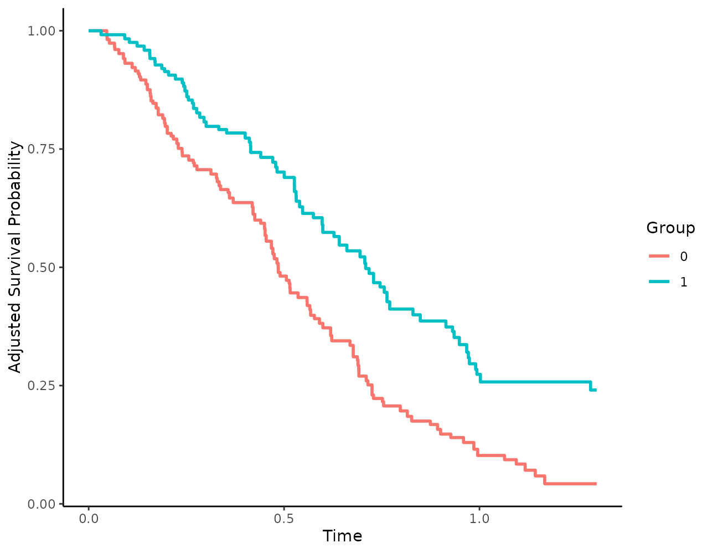

This is already fairly decent, but it could be made much more
informative as illustrated below.

## General Plot Aesthetics

To visually distinguish the survival curves, different colors are used
by default. By changing the `linetype` and `color` arguments, it is
however also possible to use black and white plots instead:

``` r
plot(s_iptw, linetype=TRUE, color=FALSE)
```

    ## Ignoring unknown labels:
    ## • colour : "Group"
    ## • fill : "Group"

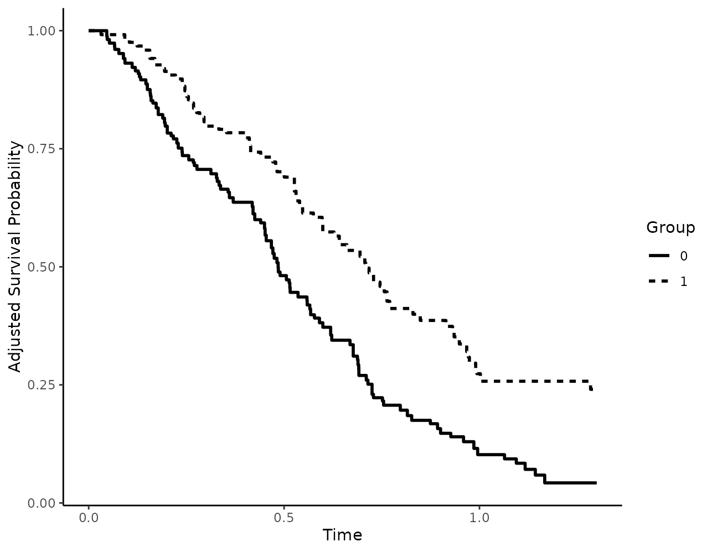

If colors should be used, it may be usefull to change the colors using
the `custom_colors` argument:

``` r
plot(s_iptw, custom_colors=c("red", "blue"))
```

    ## Ignoring unknown labels:
    ## • linetype : "Group"
    ## • fill : "Group"


When using linetypes, users can also supply custom linetypes in a
similar fashion:

``` r
plot(s_iptw, linetype=TRUE, custom_linetypes=c("dotdash", "solid"))
```

    ## Ignoring unknown labels:
    ## • fill : "Group"

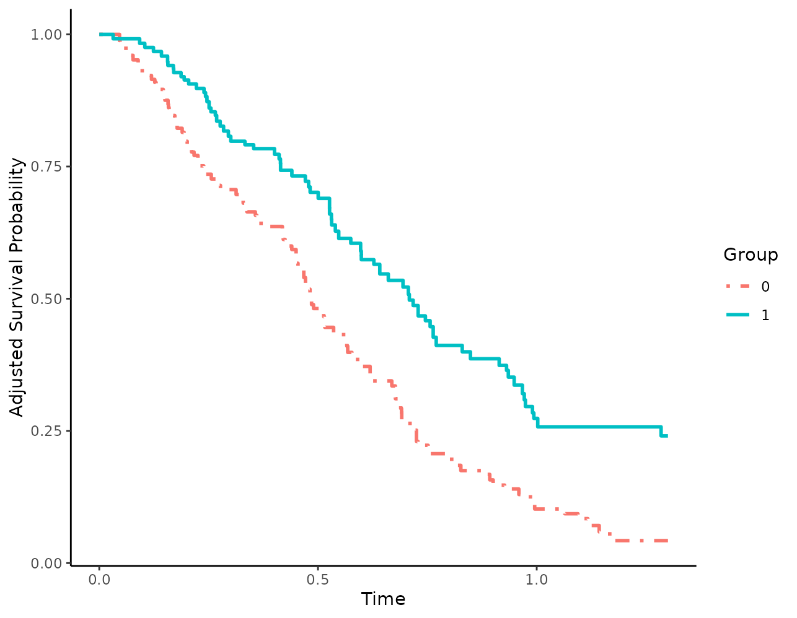

Titles and axis labels may also be changed using the respective
arguments:

``` r
plot(s_iptw, xlab="Time in Years", ylab="S(t)",
     title="This is the title", subtitle="This is the subtitle",
     legend.title="Sex")
```

    ## Ignoring unknown labels:
    ## • linetype : "Sex"
    ## • fill : "Sex"

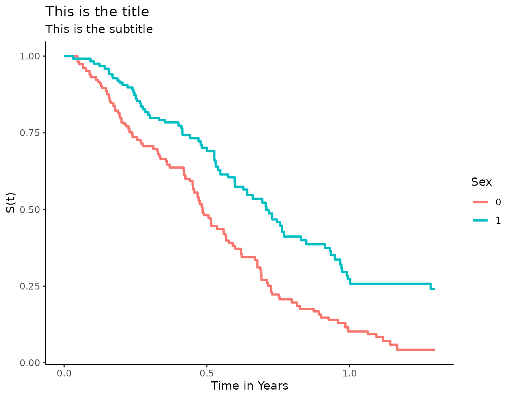

## Confidence Intervals

When confidence intervals were estimated using `conf_int=TRUE` or
`bootstrap=TRUE` in the original
[`adjustedsurv()`](https://robindenz1.github.io/adjustedCurves/reference/adjustedsurv.md)
function call, it is of course possible to visualize them using the
[`plot()`](https://rdrr.io/r/graphics/plot.default.html) method as well:

``` r
plot(s_iptw, conf_int=TRUE)
```

    ## Loading required namespace: pammtools

    ## Ignoring unknown labels:
    ## • linetype : "Group"


Note that the confidence level cannot be changed here. This can only be
done directly in the
[`adjustedsurv()`](https://robindenz1.github.io/adjustedCurves/reference/adjustedsurv.md)
function.

## Median Survival Time Indicators

The median survival time is often used as a summary statistic and to
compare different survival curves. In this package, it may be calculated
using the
[`adjusted_surv_quantile()`](https://robindenz1.github.io/adjustedCurves/reference/adjusted_surv_quantile.md)
function. However, it may also make sense to add some indicator lines to
the plot to visually help the reader to read off the median survival
time from the plot as well. This can be done using the
`median_surv_lines` argument:

``` r
plot(s_iptw, median_surv_lines=TRUE)
```

    ## Ignoring unknown labels:
    ## • linetype : "Group"
    ## • fill : "Group"
    ## Ignoring unknown labels:
    ## • linetype : "Group"
    ## • fill : "Group"


The drawn lines may also be customized. Below we make the lines thicker,
change their color and change their linetype from `"dashed"` to
`"dotdash"`:

``` r
plot(s_iptw, median_surv_lines=TRUE, median_surv_linetype="dotdash",
     median_surv_size=0.7, median_surv_color="grey")
```

    ## Ignoring unknown labels:
    ## • linetype : "Group"
    ## • fill : "Group"
    ## Ignoring unknown labels:
    ## • linetype : "Group"
    ## • fill : "Group"


It is also possible to use other survival time quantiles by changing the
`median_surv_quantile` argument:

``` r
plot(s_iptw, median_surv_lines=TRUE, median_surv_quantile=0.4)
```

    ## Ignoring unknown labels:
    ## • linetype : "Group"
    ## • fill : "Group"
    ## Ignoring unknown labels:
    ## • linetype : "Group"
    ## • fill : "Group"

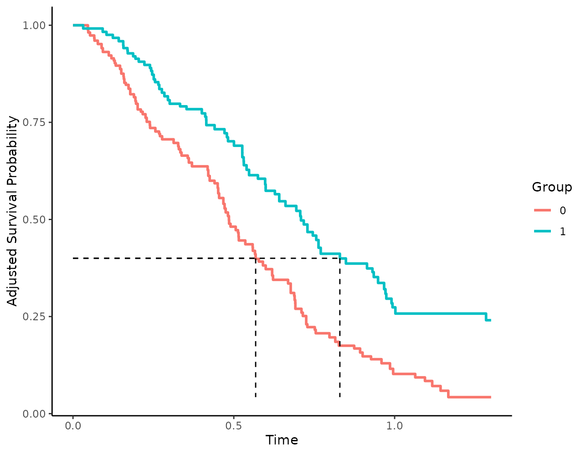

## Censoring Indicators

In standard Kaplan-Meier plots, the timing of censored observations is
often added to the plot as well. This can be done in this package as
well, using the `censoring_ind` argument. We could, for example, add
small vertical lines to show the censored observations:

``` r
plot(s_iptw, censoring_ind="lines")
```

    ## Ignoring unknown labels:
    ## • linetype : "Group"
    ## • fill : "Group"
    ## Ignoring unknown labels:
    ## • linetype : "Group"
    ## • fill : "Group"


Alternatively, points of any shape could be added as well:

``` r
plot(s_iptw, censoring_ind="points", censoring_ind_shape=3,
     censoring_ind_size=2)
```

    ## Ignoring unknown labels:
    ## • linetype : "Group"
    ## • fill : "Group"
    ## Ignoring unknown labels:
    ## • linetype : "Group"
    ## • fill : "Group"


## Risk Tables

First, let’s call the
[`plot()`](https://rdrr.io/r/graphics/plot.default.html) function with
the default risk table arguments:

``` r
plot(s_iptw, risk_table=TRUE)
```

    ## Loading required namespace: cowplot

    ## Ignoring unknown labels:
    ## • linetype : "Group"
    ## • fill : "Group"
    ## Ignoring unknown labels:
    ## • linetype : "Group"
    ## • fill : "Group"
    ## Ignoring unknown labels:
    ## • linetype : "Group"
    ## • fill : "Group"


### Changing the content of risk tables

Since we are using a weighted Kaplan-Meier estimator, the weighted
number at risk is shown by default. We could use the unweighted number
at risk by setting `risk_table_use_weights=FALSE`, but this wouldn’t
make much sense. Instead of using the weighted number at risk, we can
also use the weighted number of cumulative events:

``` r
plot(s_iptw, risk_table=TRUE, risk_table_type="n_events")
```

    ## Ignoring unknown labels:
    ## • linetype : "Group"
    ## • fill : "Group"
    ## Ignoring unknown labels:
    ## • linetype : "Group"
    ## • fill : "Group"
    ## Ignoring unknown labels:
    ## • linetype : "Group"
    ## • fill : "Group"


or the weighted cumulative number of censored observations:

``` r
plot(s_iptw, risk_table=TRUE, risk_table_type="n_cens")
```

    ## Ignoring unknown labels:
    ## • linetype : "Group"
    ## • fill : "Group"
    ## Ignoring unknown labels:
    ## • linetype : "Group"
    ## • fill : "Group"
    ## Ignoring unknown labels:
    ## • linetype : "Group"
    ## • fill : "Group"

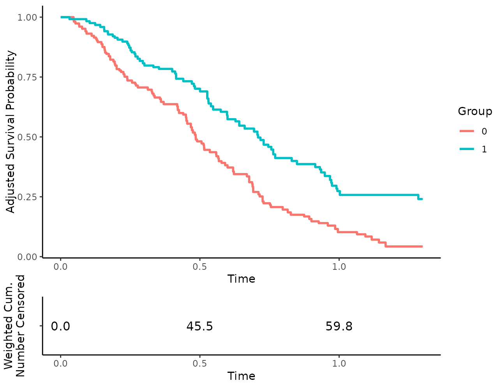

By setting `risk_table_stratify=TRUE`, we are also able to stratify the
risk table by the different levels in `variable`:

``` r
plot(s_iptw, risk_table=TRUE, risk_table_stratify=TRUE)
```

    ## Ignoring unknown labels:
    ## • linetype : "Group"
    ## • fill : "Group"
    ## Ignoring unknown labels:
    ## • linetype : "Group"
    ## • fill : "Group"
    ## Ignoring unknown labels:
    ## • linetype : "Group"
    ## • fill : "Group"


Since weights are used here, there is no guarantee that the number of
people at risk are integer values. By default the numbers are rounded to
one digit to make this clear, but we can also set the
`risk_table_digits` argument to 0 to round them to the nearest integer,
which may be a little less confusing for some people:

``` r
plot(s_iptw, risk_table=TRUE, risk_table_stratify=TRUE,
     risk_table_digits=0)
```

    ## Ignoring unknown labels:
    ## • linetype : "Group"
    ## • fill : "Group"
    ## Ignoring unknown labels:
    ## • linetype : "Group"
    ## • fill : "Group"
    ## Ignoring unknown labels:
    ## • linetype : "Group"
    ## • fill : "Group"


The risk tables only show numbers at the break points of the x-axis
shown in the survival curve plot, to make everything align nicely. To
get more numbers at more points in time, we can simply augment the
`x_breaks` or `x_n_breaks` arguments, like this:

``` r
plot(s_iptw, risk_table=TRUE, risk_table_stratify=TRUE,
     risk_table_digits=0, x_n_breaks=10)
```

    ## Ignoring unknown labels:
    ## • linetype : "Group"
    ## • fill : "Group"
    ## Ignoring unknown labels:
    ## • linetype : "Group"
    ## • fill : "Group"
    ## Ignoring unknown labels:
    ## • linetype : "Group"
    ## • fill : "Group"

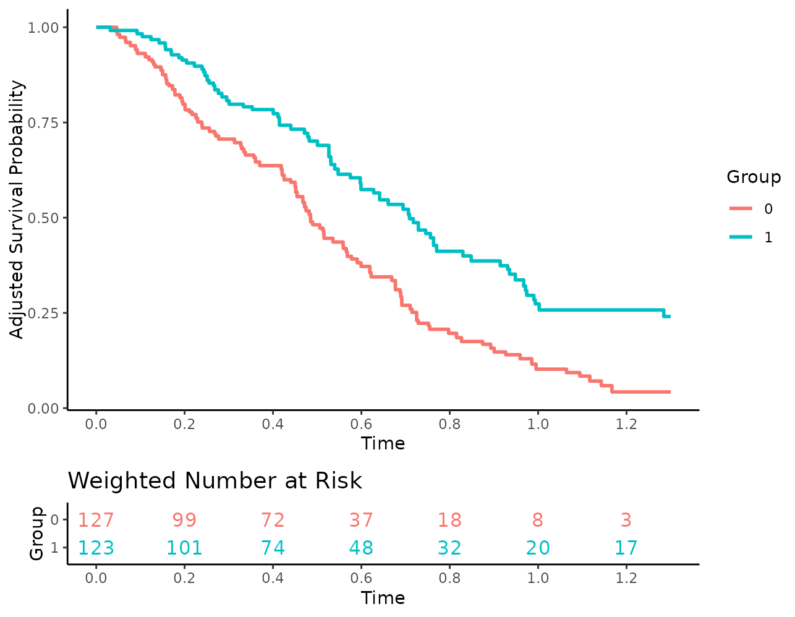

### Changing aesthetic parameters

The size and look of the numbers may be changed as well:

``` r
plot(s_iptw, risk_table=TRUE, risk_table_stratify=TRUE,
     risk_table_digits=0, x_n_breaks=10, risk_table_size=3,
     risk_table_family="serif", risk_table_fontface="italic")
```

    ## Ignoring unknown labels:
    ## • linetype : "Group"
    ## • fill : "Group"
    ## Ignoring unknown labels:
    ## • linetype : "Group"
    ## • fill : "Group"
    ## Ignoring unknown labels:
    ## • linetype : "Group"
    ## • fill : "Group"


Additionally, users may turn off the coloring of the numbers:

``` r
plot(s_iptw, risk_table=TRUE, risk_table_stratify=TRUE,
     risk_table_digits=0, x_n_breaks=10,
     risk_table_stratify_color=FALSE)
```

    ## Ignoring unknown labels:
    ## • linetype : "Group"
    ## • fill : "Group"
    ## Ignoring unknown labels:
    ## • linetype : "Group"
    ## • fill : "Group"
    ## Ignoring unknown labels:
    ## • linetype : "Group"
    ## • fill : "Group"


Or use different colors:

``` r
plot(s_iptw, risk_table=TRUE, risk_table_stratify=TRUE,
     risk_table_digits=0, x_n_breaks=10,
     risk_table_custom_colors=c("brown", "orange"))
```

    ## Ignoring unknown labels:
    ## • linetype : "Group"
    ## • fill : "Group"
    ## Ignoring unknown labels:
    ## • linetype : "Group"
    ## • fill : "Group"
    ## Ignoring unknown labels:
    ## • linetype : "Group"
    ## • fill : "Group"

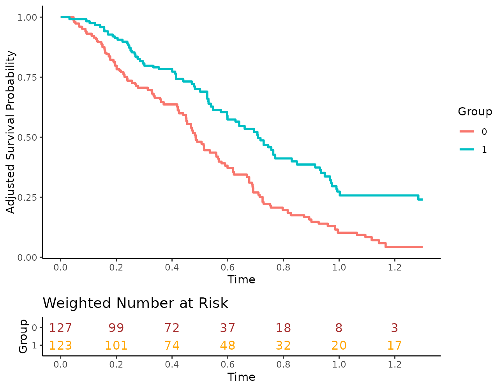

The title and axis labels may of course also be changed or removed:

``` r
plot(s_iptw, risk_table=TRUE, risk_table_stratify=TRUE,
     risk_table_digits=0, x_n_breaks=10,
     risk_table_title="Weighted Number of people at risk",
     risk_table_title_size=10, risk_table_title_position="middle",
     risk_table_ylab=NULL)
```

    ## Ignoring unknown labels:
    ## • linetype : "Group"
    ## • fill : "Group"
    ## Ignoring unknown labels:
    ## • linetype : "Group"
    ## • fill : "Group"
    ## Ignoring unknown labels:
    ## • linetype : "Group"
    ## • fill : "Group"

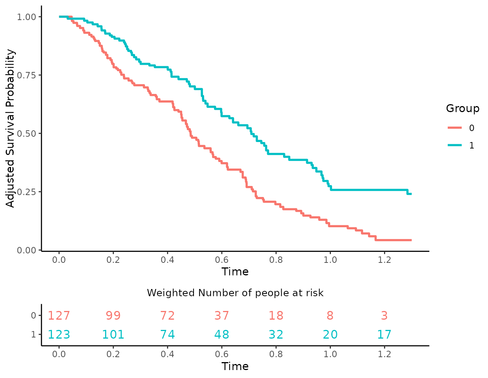

Internally, separate plots are created for the survival curves and for
the risk table and put together afterwards using the
[`plot_grid()`](https://wilkelab.org/cowplot/reference/plot_grid.html)
function of the `cowplot` package. Because of this, users may also set
different `ggplot2` themes for the plots:

``` r
plot(s_iptw, risk_table=TRUE, risk_table_stratify=TRUE,
     risk_table_digits=0, x_n_breaks=10,
     risk_table_theme=ggplot2::theme_classic(),
     gg_theme=ggplot2::theme_minimal())
```

    ## Ignoring unknown labels:
    ## • linetype : "Group"
    ## • fill : "Group"
    ## Ignoring unknown labels:
    ## • linetype : "Group"
    ## • fill : "Group"
    ## Ignoring unknown labels:
    ## • linetype : "Group"
    ## • fill : "Group"

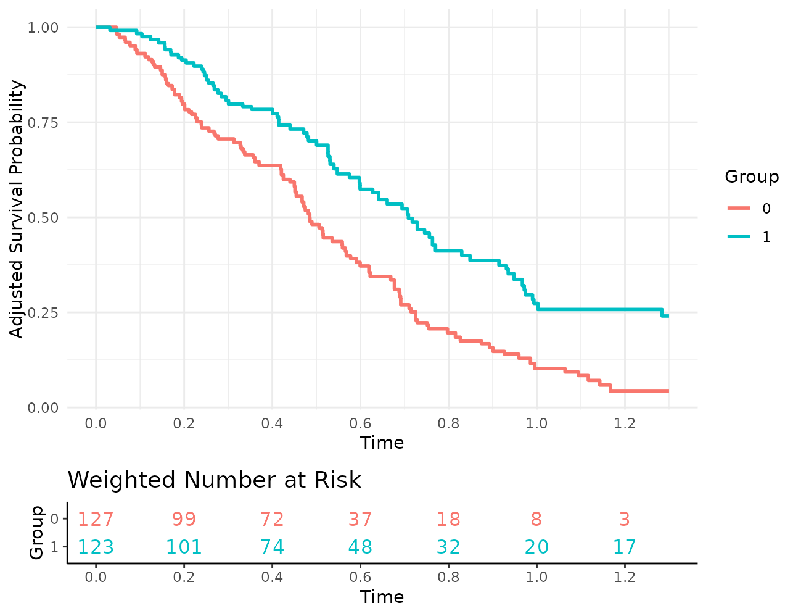

### Additional customization options

Usually, the [`plot()`](https://rdrr.io/r/graphics/plot.default.html)
function returns a standard `ggplot2` object that may be modified using
standard `ggplot2` syntax. This, however, is no longer the case when
using risk tables, because the output now consists of two plots that
have been put together.

This means that this code works fine:

``` r
# legend is successfully put at the top
plot(s_iptw) +
  theme(legend.position="top")
```

    ## Ignoring unknown labels:
    ## • linetype : "Group"
    ## • fill : "Group"


While the following code does not work:

``` r
# legend remains at the right side
plot(s_iptw, risk_table=TRUE) +
  theme(legend.position="top")
```

    ## Ignoring unknown labels:
    ## • linetype : "Group"
    ## • fill : "Group"
    ## Ignoring unknown labels:
    ## • linetype : "Group"
    ## • fill : "Group"
    ## Ignoring unknown labels:
    ## • linetype : "Group"
    ## • fill : "Group"


To still allow users to use all standard `ggplot2` options when using
risk tables we added two additional arguments: `additional_layers` and
`risk_table_additional_layers`. Users may pass a list of objects that
can be added to a `ggplot2` object to either of these arguments. All
objects in the list passed to `additional_layers` will be added to the
survival curve plot before putting it together with the risk table plot.
Similarly, all objects in the `risk_table_additional_layers` list will
be applied to the risk table plot.

The preceding example could be fixed using the following code:

``` r
more_stuff <- list(theme(legend.position="top"))
plot(s_iptw, risk_table=TRUE, additional_layers=more_stuff)
```

    ## Ignoring unknown labels:
    ## • linetype : "Group"
    ## • fill : "Group"
    ## Ignoring unknown labels:
    ## • linetype : "Group"
    ## • fill : "Group"
    ## Ignoring unknown labels:
    ## • linetype : "Group"
    ## • fill : "Group"


In this particular case, we could have also simply set the
`legend.position` to top, but this of course only works for arguments
directly supported by the
[`plot()`](https://rdrr.io/r/graphics/plot.default.html) method. Using
the arguments mentioned above, we can do quite a bit more, such as
adding more geoms:

``` r
more_stuff <- list(geom_hline(yintercept=0.7))
plot(s_iptw, risk_table=TRUE, additional_layers=more_stuff)
```

    ## Ignoring unknown labels:
    ## • linetype : "Group"
    ## • fill : "Group"
    ## Ignoring unknown labels:
    ## • linetype : "Group"
    ## • fill : "Group"
    ## Ignoring unknown labels:
    ## • linetype : "Group"
    ## • fill : "Group"

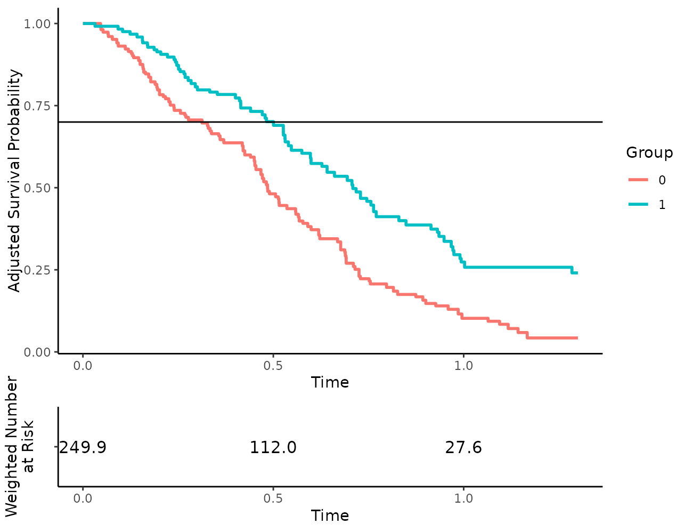

Which also works for the risk table subplot using the other argument:

``` r
# remove x-axis ticks from risk table for some reason
more_stuff <- list(theme(axis.ticks.x=element_blank()))
plot(s_iptw, risk_table=TRUE, risk_table_additional_layers=more_stuff)
```

    ## Ignoring unknown labels:
    ## • linetype : "Group"
    ## • fill : "Group"
    ## Ignoring unknown labels:
    ## • linetype : "Group"
    ## • fill : "Group"
    ## Ignoring unknown labels:
    ## • linetype : "Group"
    ## • fill : "Group"

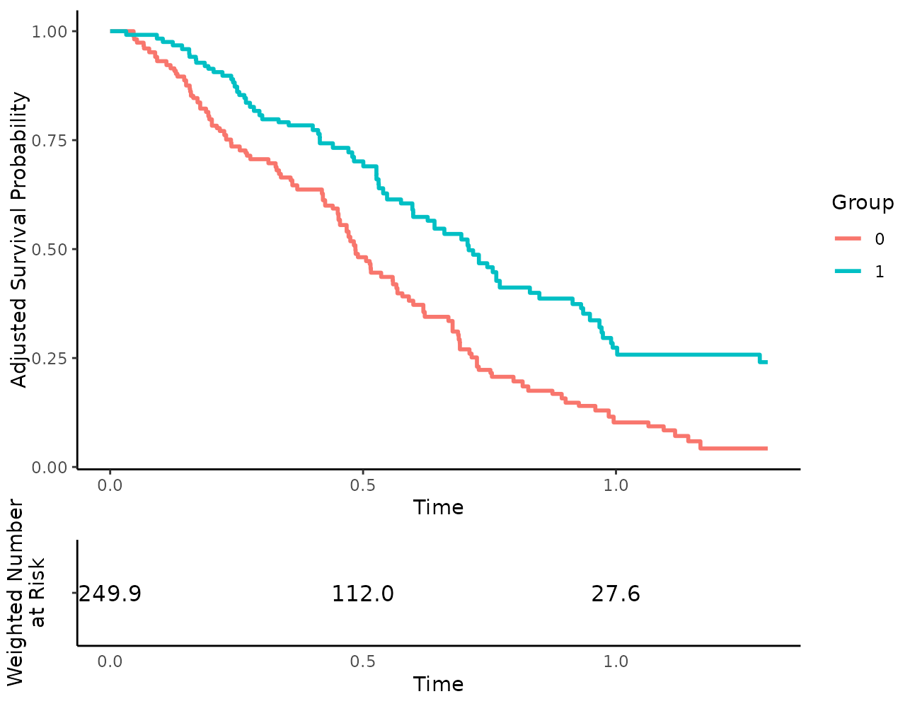

## Putting it all together

In this particular case, we would probably use something similar to the
following code to create a decent output:

``` r
plot(s_iptw, conf_int=TRUE, censoring_ind="lines", risk_table=TRUE,
     risk_table_stratify=TRUE, risk_table_digits=0, x_n_breaks=10,
     risk_table_title_size=11, median_surv_lines=TRUE,
     gg_theme=theme_bw(), risk_table_theme=theme_classic(),
     legend.position="top", custom_colors=c("blue", "red"),
     xlab="Time in Years")
```

    ## Ignoring unknown labels:
    ## • linetype : "Group"
    ## • fill : "Group"
    ## Ignoring unknown labels:
    ## • linetype : "Group"
    ## Ignoring unknown labels:
    ## • linetype : "Group"
    ## Ignoring unknown labels:
    ## • linetype : "Group"
    ## Ignoring unknown labels:
    ## • linetype : "Group"

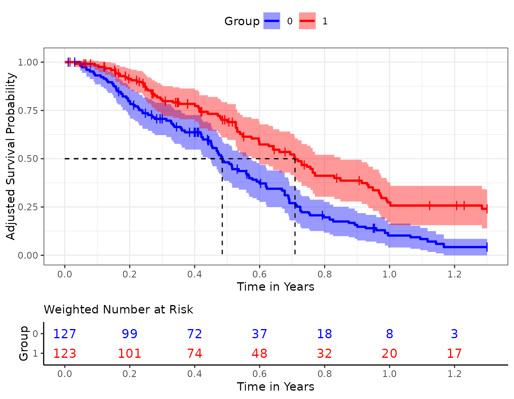

Of course this is just one of many possibilities.
