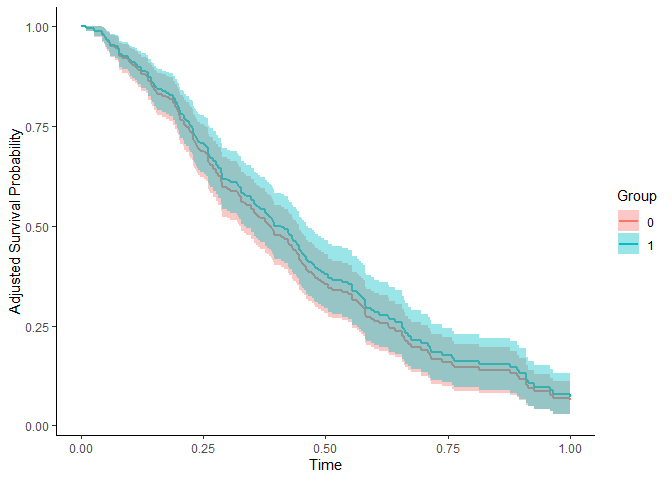
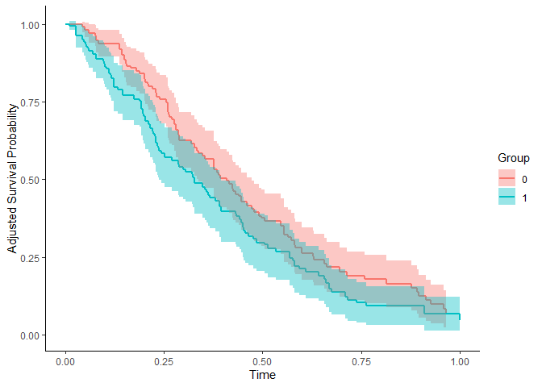
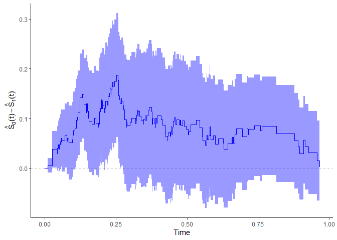

# adjustedCurves

Author: Robin Denz

## Description

`adjustedCurves` is an R-Package which can be used to estimate and plot
confounder-adjusted survival curves + confidence intervals as well as
cause-specific confounder-adjusted cumulative incidence functions +
confidence intervals using a variety of methods. It provides a
convenient wrapper around existing R-Packages on the topic and adds
additional methods and functionality on top of it. Those additional
features include the calculation of adjusted restricted mean survival
times and testing whether two confounder-adjusted survival curves are
different in a given interval.

Detailed descriptions of each method can be found in the literature
cited in the documentation.

## Installation

A stable version can be installed directly from CRAN using:

``` r
install.packages("adjustedCurves")
```

The developmental version can be installed using the `devtools`
R-Package:

``` r
library(devtools)

install_github("https://github.com/RobinDenz1/adjustedCurves")
```

## Bug Reports and Feature Requests

If you encounter any bugs or have any specific feature requests, please
file an [Issue](https://github.com/RobinDenz1/adjustedCurves/issues).

## Examples

This minimal example shows how to estimate and plot adjusted survival
curves using *Direct Adjustment* with this package:

``` r
library(adjustedCurves)
library(ggplot2)
library(survival)

# simulate some data as example
set.seed(31)
sim_dat <- sim_confounded_surv(n=250, max_t=1.2, group_beta=0)
sim_dat$group <- as.factor(sim_dat$group)

# estimate a cox-regression for the outcome
cox_mod <- coxph(Surv(time, event) ~ x1 + x2 + x4 + x5 + group,
                 data=sim_dat, x=TRUE)

# use it to estimate adjusted survival curves
adjsurv <- adjustedsurv(data=sim_dat,
                        variable="group",
                        ev_time="time",
                        event="event",
                        method="direct",
                        outcome_model=cox_mod,
                        conf_int=TRUE)

# plot with confidence intervals
plot(adjsurv, conf_int=TRUE)
```



Here is an example of how to estimate and plot adjusted survival curves
using *Inverse Probability of Treatment Weighting*:

``` r
# estimate a treatment assignment model
glm_mod <- glm(group ~ x2 + x3 + x5 + x6, data=sim_dat,
               family="binomial"(link="logit"))

# use it to estimate adjusted survival curves
adjsurv <- adjustedsurv(data=sim_dat,
                        variable="group",
                        ev_time="time",
                        event="event",
                        method="iptw_km",
                        treatment_model=glm_mod,
                        conf_int=TRUE)

# plot with confidence intervals
plot(adjsurv, conf_int=TRUE)
```



It is also possible to plot the difference between two curves using the
[`plot_curve_diff()`](https://robindenz1.github.io/adjustedCurves/reference/plot_curve_diff.md)
function:

``` r
plot_curve_diff(adjsurv, conf_int=TRUE, color="blue")
```



To test whether the two adjusted survival curves are different in a
specified interval (here 0 to 0.75), the `adjustedsurv` call has to be
made with `bootstrap=TRUE`:

``` r
adjsurv <- adjustedsurv(data=sim_dat,
                        variable="group",
                        ev_time="time",
                        event="event",
                        method="direct",
                        outcome_model=cox_mod,
                        conf_int=TRUE,
                        bootstrap=TRUE,
                        n_boot=1000)

adj_test <- adjusted_curve_test(adjsurv, from=0, to=0.75)
summary(adj_test)
#> ------------------------------------------------------------------
#>    Test of the Difference between two adjusted Survival Curves
#> ------------------------------------------------------------------
#> 
#> Using the interval: 0 to 0.75 
#> 
#>             ABC ABC SE 95% CI (lower) 95% CI (upper) P-Value N Boot
#> 0 vs. 1 -0.0129 0.0268         -0.066         0.0401   0.616   1000
#> ------------------------------------------------------------------
```

More examples can be found in the documentation and the vignettes.

## Citation

The main paper associated with this R-Package is:

Robin Denz, Renate Klaaßen-Mielke, and Nina Timmesfeld (2023). *A
comparison of different methods to adjust survival curves for
confounders*. Statistics in Medicine. 42.10, pp. 1461-1479.
<doi:10.1002/sim.9681>

In addition, the relevant primary literature of the respective method
should be cited. This can be found in the documentation of the method.

## License

© 2024 Robin Denz

The contents of this repository are distributed under the GNU General
Public License. You can find the full text of this License in this
github repository. Alternatively, see <http://www.gnu.org/licenses/>.
